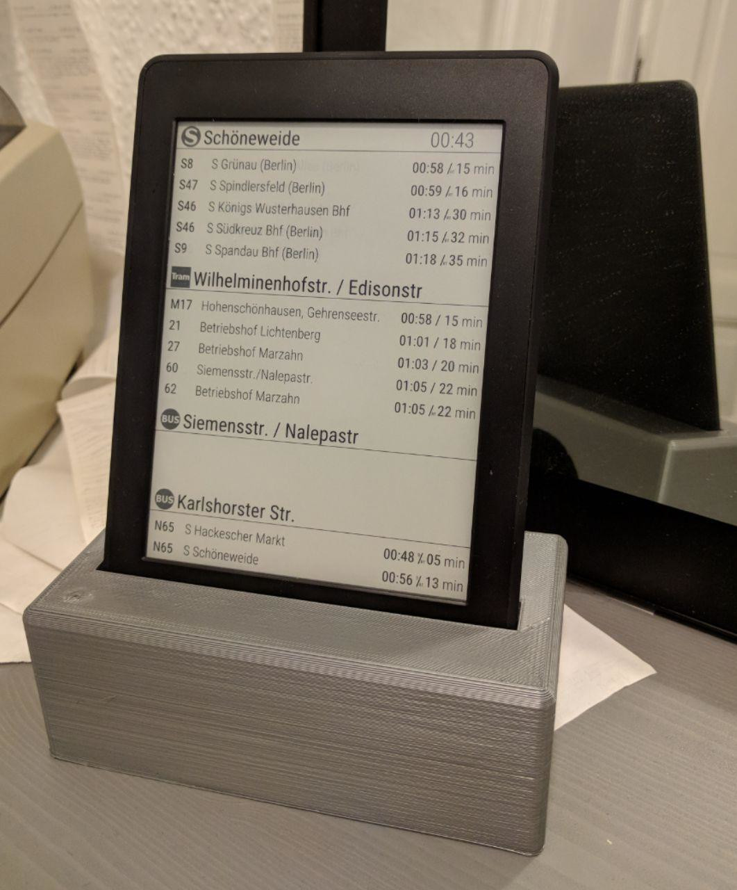

# kindle-abfahrt    

**kindle-abfahrt** is a small Go program which fetches and displays departure information of public transportation services on a Kindle Paperwhite 3 (PW3).
Currently it’s supporting the official API of the Verkehrsverbund Berlin-Brandenburg (VBB), which is basically the HAFAS ReST API by [HaCon](https://www.hacon.de/) used by many more transportation authorities in Germany and Europe.

**Note:** This is just a quick hack which is specifically tailored to run on a PW3 and use the VBB API.
Whilst it should be relatively easy to support other Kindle models (different screen resolutions) and add support for more data providers,
this has not been implemented as of yet. Right now this is, if any, a starting point to develop one’s own information display.

You need to jailbroken/rooted Kindle for this to work. Check out: https://www.mobileread.com/forums/showthread.php?t=320564

(The stand was designed with *[OpenSCAD](http://www.openscad.org/)* and its source files can be found in the `stand` folder.)

## Description

The Kindle Paperwhite 3 comes with an 800 MHz i.MX 6 SoloLite ARMv7 processor and thus is quite capable to execute all necessary tasks on its own.
First it queries the data provider every n minutes to receive information about planned departures and then draws an in-memory image using the `draw2d` library.
This image is converted to grayscale and exported as a PNG file. The Kindle comes with a system command (`eips`) to draw a given image file to the framebuffer.
This command is called after exporting said PNG file. And that’s all there is to it.

The Kindle lasts about 24h on battery with a refresh rate of one minute. Keeping the charger attached is the recommended mode of operation.

Other Kindle models have different screen resolutions and thus need tweaking, as the screen layout is hardcoded right now.

At the moment the user has to take care of stopping and restarting the stock GUI and tweaking the system so that the Kindle stays powered on and does not draw over our screen.
Take a look at the start script which is mentioned in the Notes section. It should give a rough idea of all the necessary steps.

A simple caching mechanism for the returned raw API data is implemented as well so that the number of API queries can be reduced while still updating the relative departure times with every refresh.

## Installation

- `git clone https://github.com/buckket/kindle-abfahrt.git`
- `go get -u github.com/gobuffalo/packr/v2/packr2`
- Adjust stations, API Key, layout, timeouts, etc.
- `./build.sh`
- Copy the resulting binary file to your rooted Kindle:
  - `scp kindle-abfahrt root@<KINDLE>:/tmp/`
  - SSH to your Kindle and run:
    - `mntroot rw`
    - `cp /tmp/kindle-abfahrt /usr/local/bin`
    - `mntroot ro`
- [Install zoneinfo data (required for timezone conversion)](https://wiki.mobileread.com/wiki/Kindle_Touch_Hacking#Setting_the_time_zone)
- TODO: Write action for KUAL and explain installation process

## Usage

- Stop running stock GUI via `stop lab126_gui`
- Start `kindle-abfahrt` either via cron, tmux or [KUAL](https://www.mobileread.com/forums/showthread.php?t=203326)
- Allow remote connections: `iptables -A INPUT -p tcp --dport 8080 -j ACCEPT`

## Notes

- A similar project which displays weather information and is written in Go as well: https://github.com/DDRBoxman/kindle-weather (very useful startup script)
- Instructions on how to disable the backlight can be found here: https://www.mobileread.com/forums/showthread.php?t=200266
- To disable the screensaver execute `/usr/bin/ds.sh` on your Kindle
- It’s advisable to add `ntpdate` to the crontab file so that the system time stays in sync
- You need an API key to access the VBB API, you can get one here: https://www.vbb.de/unsere-themen/vbbdigital/api-entwicklerinfos/api-fahrplaninfo

## ToDo

- Add generic interface to support more data providers
- Allow easy customization of queried stations and screen layout
- Test and support other Kindle models as well

## License / Copyright

- kindle-abfahrt is licensed under GNU GPLv3+
- The [Roboto](https://github.com/google/roboto/) font is licenced under Apache License, Version 2.0 
- The S-Bahn, Tram and Bus logos are under public domain and taken from Wikimedia Commons