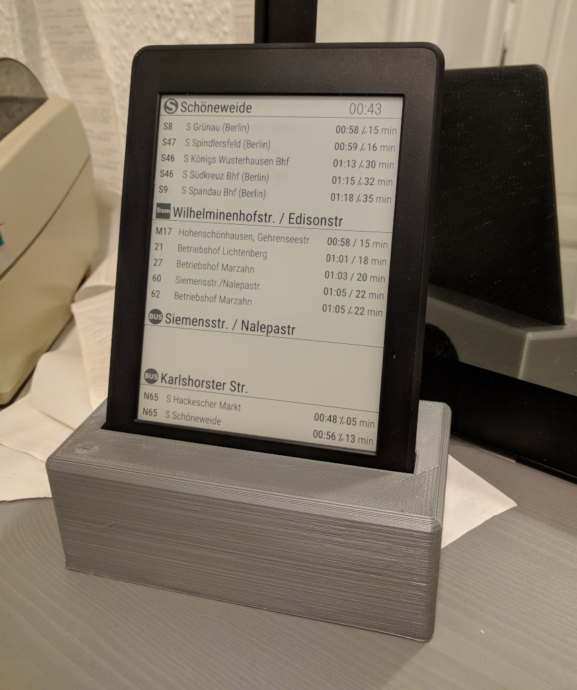

# kindle-abfahrt    

**kindle-abfahrt** is a small Go program which fetches and displays local departure information of public transportation services on a *Kindle Paperwhite 3* (PW3).
Currently it’s using the official API of the *Verkehrsverbund Berlin-Brandenburg* (VBB).

**Note:** This is just  a quick hack which is specifically tailored to run on a PW3 and use the VBB API.
Whilst it should be relatively easy to support other Kindle models (different screen resolutions) and add support for more data providers,
it is not in the scope of this project. This is, if any, a starting point to develop one’s own information display.

You need to jailbroken Kindle for this to work. Check out: https://www.mobileread.com/forums/showthread.php?t=320564

(The stand was designed with *OpenSCAD* and its source files can be found in the `stand` folder.)

## Installation
- `git clone https://github.com/buckket/kindle-abfahrt.git`
- `env GOOS=linux GOARCH=arm GOARM=7 go build`
- Copy the resulting binary and the media assets (fonts, images) to your Kindle

## Notes

- A similar project which displays weather information and is written in Go as well: https://github.com/DDRBoxman/kindle-weather (very useful startup script)
- The Kindle comes with no zoneinfo data pre-installed, for this program to work you have to copy the needed files yourself: https://wiki.mobileread.com/wiki/Kindle_Touch_Hacking#Setting_the_time_zone
- Instructions on how to disable the backlight can be found here: https://www.mobileread.com/forums/showthread.php?t=200266
- To disable the screensaver execute `/usr/bin/ds.sh` on your Kindle

## License / Copyright

- kindle-abfahrt is licensed under GNU GPLv3+
- The [Roboto](https://github.com/google/roboto/) font is licenced under Apache License, Version 2.0 
- The S-Bahn, Tram and Bus logos are under public domain and taken from Wikimedia Commons